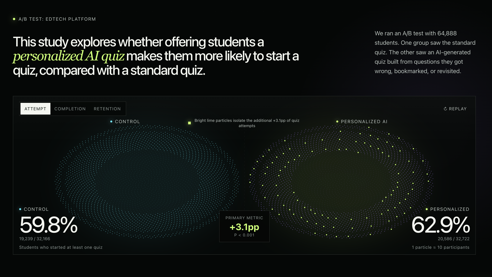
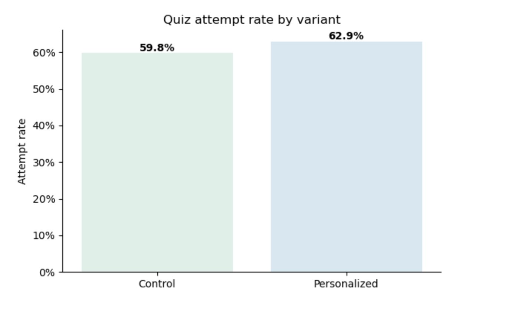
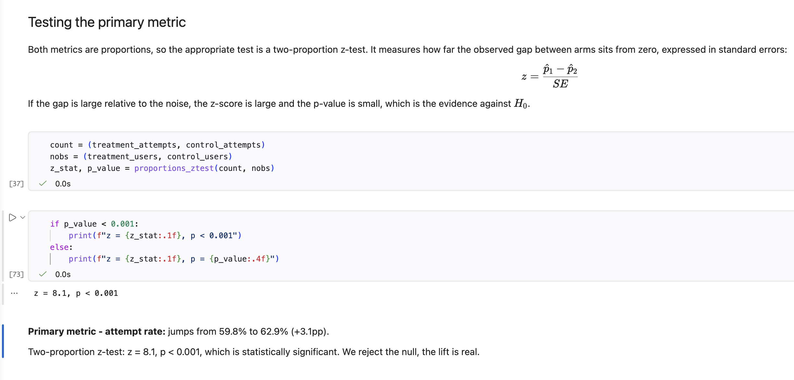
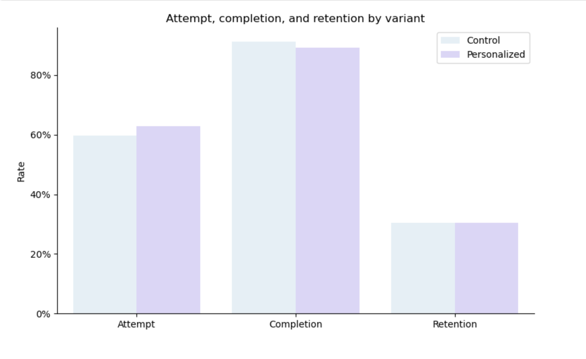
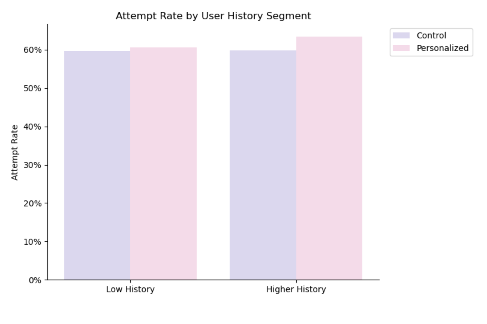

# Personalized AI Quizzes: An A/B Test on an EdTech Platform

Does giving students AI-generated quizzes built from their own mistakes get them to practice more? This project runs the full A/B test to find out, from experiment design through to a ship decision.

[View the analysis notebook](./analysis.ipynb)

## Dashboard

I built an interactive dashboard to make the experiment and its results easy to explore. The notebook provides a detailed walkthrough of the statistical analysis and methodology.

[Open the interactive dashboard](https://ab-test.site/)

<p align="center">
  
</p>

## The question

The platform builds a personalized quiz for each student from the questions they got wrong, the ones they bookmarked, and the lectures they re-watched. The experiment tests whether that personalization gets students to take more quizzes than the standard version everyone else sees, and whether it does so without hurting completion or retention.

- **Primary metric:** quiz attempt rate
- **Guardrails:** completion rate (among users who started a quiz) and 7-day retention
- **Sample:** ~65,000 users, randomly split into control and treatment
- **Window:** June 9 to June 15, 2026

## The finding

| Metric | Control | Treatment | Change | Significant? |
|---|---|---|---|---|
| Attempt rate | 59.8% | 62.9% | +3.1pp | Yes (p < 0.001) |
| Completion (among starters) | 91.3% | 89.3% | -2.0pp | Yes (p < 0.001) |
| Overall completion | 54.6% | 56.2% | +1.6pp | Yes |
| 7-day retention | 30.4% | 30.5% | +0.2pp | No (p = 0.62) |

Personalization pulled more students into quizzes, but the personalized quiz, being built from a student's own weak spots, was harder, so those who started were slightly more likely to abandon it. Because so many more students started, the overall share completing at least one quiz still rose. Retention did not move.

The effect was concentrated almost entirely among users the personalization had history to work with. Users with prior activity saw a 3.6pp attempt lift (significant); users with little history saw only 1.1pp (not significant), a cold-start problem.

<p align="center">
  
</p>

<p align="center"><em>The personalized quiz increased the attempt rate from 59.8% to 62.9%.</em></p>

<p align="center">
  
</p>

<p align="center"><em>The primary-metric test produced z = 8.1 and p &lt; 0.001.</em></p>

## The recommendation

Not a ship-to-everyone. A targeted rollout to users with sufficient history, where the feature clearly works, paired with two pieces of follow-up before a broader launch: calibrate difficulty to recover the completion drop, and design a separate cold-start approach for low-history users. A follow-up test should then check whether difficulty changes restore completion and whether the engagement lift eventually reaches retention over a longer window.

## What's in the analysis

- Data cleaning: duplicates, impossible rows (completions exceeding starts), and reasoned handling of missing values
- Validity checks: sample ratio mismatch (chi-square, evaluated against the industry p < 0.001 threshold) and baseline covariate balance
- Retrospective power analysis: required sample size and minimum detectable effect
- Two-proportion z-tests with 95% confidence intervals for every metric
- Segment analysis by prior platform history (the cold-start finding)
- Robustness notes: multiple comparisons, CUPED, and the limits of a single-window design

<p align="center">
  
  
</p>

<p align="center"><em>Left: the primary metric and guardrails. Right: the exploratory history-segment result used to inform the rollout recommendation.</em></p>

## Running it

```
pip install -r requirements.txt
jupyter notebook analysis.ipynb
```

The dataset is in `data/`. The notebook runs top to bottom.

## Stack

Python, pandas, NumPy, statsmodels, SciPy, seaborn, matplotlib.

## Note on the data

The dataset is a realistic simulation of an EdTech platform's experiment data, modeled on a real product. It is used to demonstrate the full experimentation workflow: design, validity checks, testing, segmentation, and a launch decision.
